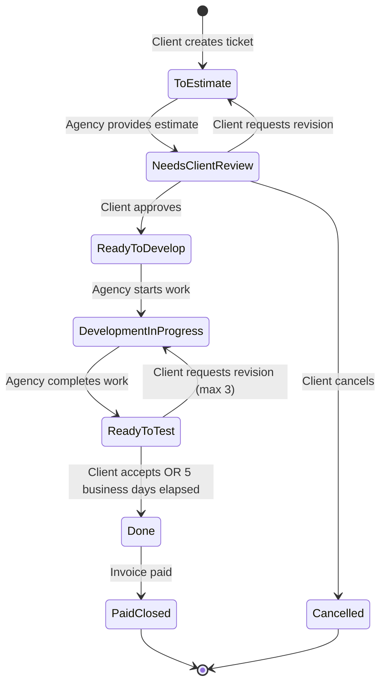

# Workflow Logic - Time & Materials System

## Overview

This document details the business rules, state transitions, and automated processes that power the Time & Materials project management workflow.

---

## Ticket Lifecycle Workflow

### State Diagram



---

## State Definitions & Rules

### 1. To Estimate

**Description:** New ticket awaiting agency estimation

**Entry Conditions:**
- Client creates new ticket
- Client requests revision on estimate

**Exit Conditions:**
- Agency provides estimate → Move to "Needs Client Review"

**Permissions:**
- **Client:** Can edit title, description, priority
- **Agency:** Can view, add estimate

**SLA:**
- Agency should provide estimate within 1 business day
- Show warning if estimate overdue

**UI Indicators:**
- Gray badge
- Clock icon
- Show days since creation

---

### 2. Needs Client Review

**Description:** Estimated ticket awaiting client approval

**Entry Conditions:**
- Agency provides estimate from "To Estimate"

**Exit Conditions:**
- Client approves → Move to "Ready to Develop"
- Client requests revision → Move back to "To Estimate"
- Client cancels → Move to "Cancelled"

**Permissions:**
- **Client:** Can approve, request revision, or cancel
- **Agency:** Can view only (no edits)

**Actions Available:**
- **Approve:** Accept estimate and move to development queue
- **Request Revision:** Send back to agency with feedback
- **Cancel:** Archive ticket (no further action)

**UI Indicators:**
- Blue badge
- Eye icon
- Show estimate details prominently
- Display "Approve," "Revise," and "Cancel" buttons

---

### 3. Ready to Develop

**Description:** Approved ticket in development queue

**Entry Conditions:**
- Client approves estimate from "Needs Client Review"

**Exit Conditions:**
- Agency starts work → Move to "Development in Progress"

**Permissions:**
- **Client:** Can reorder priority within this column only
- **Agency:** Can assign to developer, start work

**Priority Ordering:**
- Clients can drag-drop to reorder tickets
- Higher priority tickets should be worked on first
- Agency respects client priority order

**UI Indicators:**
- Purple badge
- Inbox icon
- Show position in queue (#1, #2, etc.)

---

### 4. Development in Progress

**Description:** Active development work

**Entry Conditions:**
- Agency starts work from "Ready to Develop"
- Client requests revision from "Ready to Test"

**Exit Conditions:**
- Agency completes and tests → Move to "Ready to Test"

**Permissions:**
- **Client:** Can view only (no edits, no priority changes)
- **Agency:** Can log time, update progress

**Time Tracking:**
- Agency logs hours via time log form
- actualHours updates automatically
- Show progress vs estimate

**UI Indicators:**
- Yellow badge
- Code icon
- Show assigned developer
- Show time logged vs estimated
- Show progress bar (if applicable)

---

### 5. Ready to Test

**Description:** Deployed feature awaiting client testing

**Entry Conditions:**
- Agency completes work from "Development in Progress"

**Exit Conditions:**
- Client accepts → Move to "Done"
- Client requests revision → Move to "Development in Progress" (increment revisionCount)
- 5 business days elapsed → Auto-move to "Done"

**Permissions:**
- **Client:** Can accept or request revision (max 3)
- **Agency:** Can view only

**Automatic Approval:**
- Start 5-business-day timer when ticket enters this state
- Set `testingStartDate` to current date/time
- Calculate `approvalDeadline` = testingStartDate + 5 business days
- Run daily cron job to check for expired deadlines
- Auto-move to "Done" if deadline passed
- Notify both parties before and after auto-approval

**Revision Limits:**
- Maximum 3 revisions per ticket
- Track `revisionCount` field
- Disable "Request Revision" button when limit reached
- Show warning at revision 2: "1 revision remaining"

**UI Indicators:**
- Orange badge
- TestTube icon
- Countdown timer: "3 days remaining"
- Warning color (red) when < 1 day remaining
- Show revision count: "Revisions: 1/3"
- Display "Accept" and "Request Revision" buttons

---

### 6. Done

**Description:** Completed features ready for billing

**Entry Conditions:**
- Client accepts from "Ready to Test"
- Automatic approval after 5 business days

**Exit Conditions:**
- Invoice paid → Move to "Paid & Closed"

**Permissions:**
- **Client:** Can view only
- **Agency:** Can view, include in invoice

**Billing:**
- Tickets in this state are available for invoicing
- Agency selects tickets when generating invoice
- Total hours from actualHours field used for billing

**UI Indicators:**
- Green badge
- CheckCircle icon
- Show "Ready to invoice" label
- Display total hours worked

---

### 7. Paid & Closed

**Description:** Archived paid tickets

**Entry Conditions:**
- Associated invoice marked as paid

**Exit Conditions:**
- None (terminal state)

**Permissions:**
- **Client:** Can view only (read-only archive)
- **Agency:** Can view only (read-only archive)

**Archival Rules:**
- Cannot edit archived tickets
- Cannot include in new invoices (prevent double-billing)
- Can view for historical reference
- Can export for reporting

**UI Indicators:**
- Dark gray badge
- Archive icon
- Show associated invoice link
- Display paid date

---

### 8. Cancelled (Optional)

**Description:** Cancelled tickets (not proceeding)

**Entry Conditions:**
- Client cancels from "Needs Client Review"

**Exit Conditions:**
- None (terminal state)

**Permissions:**
- **Both:** View only

**Reasoning:**
- Track cancelled requests for analytics
- No billing occurs for cancelled tickets
- Can uncancel if needed (admin action)

---

## Business Rules

### Rule 1: Automatic Approval After 5 Business Days

**Purpose:** Ensure timely client feedback and prevent bottlenecks

**Implementation:**

```typescript
// Cron job runs daily at midnight UTC
// Location: src/app/api/cron/auto-approve/route.ts

async function autoApproveTickets() {
  const today = new Date();

  // Find tickets in "Ready to Test" with expired deadlines
  const expiredTickets = await payload.find({
    collection: 'tickets',
    where: {
      status: { equals: 'ready_to_test' },
      approvalDeadline: { less_than: today },
    },
  });

  for (const ticket of expiredTickets.docs) {
    // Move to "Done"
    await payload.update({
      collection: 'tickets',
      id: ticket.id,
      data: { status: 'done' },
    });

    // Log auto-approval event
    console.log(`Auto-approved ticket ${ticket.id}`);

    // Send notifications
    await sendNotification({
      user: ticket.createdBy,
      type: 'ticket_auto_approved',
      message: `Your ticket "${ticket.title}" was automatically approved after 5 business days`,
      relatedTicket: ticket.id,
    });

    await sendNotification({
      user: ticket.assignedTo,
      type: 'ticket_auto_approved',
      message: `Ticket "${ticket.title}" was automatically approved`,
      relatedTicket: ticket.id,
    });
  }
}
```

**Configuration (Vercel):**

```json
// vercel.json
{
  "crons": [
    {
      "path": "/api/cron/auto-approve",
      "schedule": "0 0 * * *"
    }
  ]
}
```

**Notifications:**
- 2 days before deadline: "Reminder: Ticket expires in 2 days"
- 1 day before deadline: "⚠️ Urgent: Ticket expires tomorrow"
- On auto-approval: "Ticket automatically approved"

---

### Rule 2: Maximum 3 Revisions Per Ticket

**Purpose:** Prevent endless revision cycles and scope creep

**Implementation:**

```typescript
// In Ticket collection beforeChange hook
// Location: src/collections/Tickets/hooks/index.ts

async function validateRevisionLimit({ data, req, operation, originalDoc }) {
  if (operation === 'update' && data.status === 'development_in_progress') {
    // Check if moving from "Ready to Test" (revision request)
    if (originalDoc.status === 'ready_to_test') {
      // Increment revision count
      data.revisionCount = (originalDoc.revisionCount || 0) + 1;

      // Enforce limit
      if (data.revisionCount > 3) {
        throw new Error('Maximum revision limit (3) exceeded for this ticket');
      }

      // Create revision record (optional: for history tracking)
      await payload.create({
        collection: 'ticket-revisions',
        data: {
          ticket: originalDoc.id,
          revisionNumber: data.revisionCount,
          requestedBy: req.user.id,
          reason: data.revisionReason || 'No reason provided',
        },
      });
    }
  }

  return data;
}
```

**UI Enforcement:**

```typescript
// In TicketDetailPanel component
const canRequestRevision = ticket.revisionCount < 3;

return (
  <Button
    onClick={handleRevisionRequest}
    disabled={!canRequestRevision}
  >
    {canRequestRevision
      ? `Request Revision (${ticket.revisionCount}/3 used)`
      : 'Revision Limit Reached'}
  </Button>
);
```

**Edge Cases:**
- If limit reached, ticket must be accepted as-is or cancelled
- Agency can waive limit (manual override by admin)
- Revision count resets if new ticket created (not a revision)

---

### Rule 3: Payment Terms & Activity Suspension

**Purpose:** Ensure timely payment and protect agency cash flow

**Implementation:**

```typescript
// Cron job runs daily
// Location: src/app/api/cron/check-payments/route.ts

async function checkOverduePayments() {
  const today = new Date();

  // Find pending invoices past due date
  const overdueInvoices = await payload.find({
    collection: 'invoices',
    where: {
      status: { equals: 'pending' },
      dueDate: { less_than: today },
    },
  });

  for (const invoice of overdueInvoices.docs) {
    // Calculate days overdue
    const daysOverdue = Math.floor(
      (today.getTime() - new Date(invoice.dueDate).getTime()) / (1000 * 60 * 60 * 24)
    );

    // Update invoice status
    await payload.update({
      collection: 'invoices',
      id: invoice.id,
      data: { status: 'overdue' },
    });

    // If >5 business days overdue, suspend client
    if (daysOverdue > 5) {
      await payload.update({
        collection: 'users',
        id: invoice.clientUser,
        data: { isActive: false },
      });

      // Send suspension notification
      await sendNotification({
        user: invoice.clientUser,
        type: 'account_suspended',
        message: `Your account has been suspended due to overdue invoice ${invoice.invoiceNumber}. Please contact billing.`,
        relatedInvoice: invoice.id,
      });
    } else {
      // Send reminder notification
      await sendNotification({
        user: invoice.clientUser,
        type: 'payment_overdue',
        message: `Invoice ${invoice.invoiceNumber} is ${daysOverdue} days overdue. Please submit payment to avoid account suspension.`,
        relatedInvoice: invoice.id,
      });
    }
  }
}
```

**Client Restriction:**

```typescript
// Middleware check
// Location: src/middleware.ts

export async function middleware(request: NextRequest) {
  const session = await getSession();

  if (session?.user && session.user.role === 'client') {
    // Check if user is active
    if (!session.user.isActive) {
      // Redirect to suspended account page
      if (!request.nextUrl.pathname.startsWith('/account-suspended')) {
        return NextResponse.redirect(new URL('/account-suspended', request.url));
      }
    }
  }

  return NextResponse.next();
}
```

**UI Banner:**

```typescript
// Display warning banner on all pages when account suspended
{user.isActive === false && (
  <Alert variant="destructive">
    <AlertCircle className="h-4 w-4" />
    <AlertTitle>Account Suspended</AlertTitle>
    <AlertDescription>
      Your account has been suspended due to an overdue payment.
      Please contact billing to restore access.
      <Link href="/invoices" className="underline ml-2">View Invoices</Link>
    </AlertDescription>
  </Alert>
)}
```

**Payment Reminders:**
- Due date: "Invoice due today"
- 2 days overdue: "Payment overdue - please submit payment"
- 5 days overdue: "⚠️ Final notice - account will be suspended"
- 6+ days overdue: "Account suspended - contact billing"

---

### Rule 4: Invoice Generation & Ticket Archival

**Purpose:** Prevent double-billing and maintain clean billing records

**Implementation:**

```typescript
// Invoice generation logic
// Location: src/lib/data/payload/custom/invoice-actions.ts

async function generateInvoice(params: {
  billingPeriodStart: Date;
  billingPeriodEnd: Date;
  clientUserId: string;
  ticketIds: string[];
  hourlyRate: number;
  notes?: string;
}) {
  // Validate tickets are in "Done" status
  const tickets = await payload.find({
    collection: 'tickets',
    where: {
      id: { in: params.ticketIds },
      status: { equals: 'done' },
      invoice: { exists: false }, // Ensure not already invoiced
    },
  });

  if (tickets.docs.length !== params.ticketIds.length) {
    throw new Error('Some tickets are not available for invoicing (already invoiced or not in Done status)');
  }

  // Calculate totals
  const totalHours = tickets.docs.reduce((sum, ticket) => sum + ticket.actualHours, 0);
  const totalAmount = totalHours * params.hourlyRate;

  // Create invoice
  const invoice = await payload.create({
    collection: 'invoices',
    data: {
      billingPeriodStart: params.billingPeriodStart,
      billingPeriodEnd: params.billingPeriodEnd,
      tickets: params.ticketIds,
      clientUser: params.clientUserId,
      totalHours,
      hourlyRate: params.hourlyRate,
      totalAmount,
      status: 'pending',
      notes: params.notes,
      // dueDate set automatically in beforeChange hook
    },
  });

  // DO NOT move tickets to "Paid & Closed" yet
  // Tickets remain in "Done" until invoice is paid

  return invoice;
}

// Mark invoice as paid
async function markInvoiceAsPaid(invoiceId: string) {
  const invoice = await payload.findByID({
    collection: 'invoices',
    id: invoiceId,
  });

  if (invoice.status === 'paid') {
    throw new Error('Invoice already paid');
  }

  // Update invoice
  await payload.update({
    collection: 'invoices',
    id: invoiceId,
    data: {
      status: 'paid',
      paidDate: new Date(),
    },
  });

  // Move all associated tickets to "Paid & Closed"
  for (const ticketId of invoice.tickets) {
    await payload.update({
      collection: 'tickets',
      id: ticketId,
      data: {
        status: 'paid_closed',
        invoice: invoiceId,
      },
    });
  }

  // Reactivate client (if suspended)
  await payload.update({
    collection: 'users',
    id: invoice.clientUser,
    data: { isActive: true },
  });

  // Send payment confirmation
  await sendNotification({
    user: invoice.clientUser,
    type: 'invoice_paid',
    message: `Thank you! Invoice ${invoice.invoiceNumber} has been marked as paid.`,
    relatedInvoice: invoiceId,
  });
}
```

**Double-Billing Prevention:**
- Check `invoice` field on ticket before including in new invoice
- If ticket.invoice exists, it cannot be added to another invoice
- UI filters out already-invoiced tickets from selection

---

### Rule 5: Business Day Calculations

**Purpose:** Accurate deadline calculations excluding weekends and holidays

**Implementation:**

```typescript
// Utility function
// Location: src/lib/utils/date-utils.ts

/**
 * Add business days to a date (excluding weekends and holidays)
 */
export function addBusinessDays(date: Date, days: number): Date {
  const result = new Date(date);
  let addedDays = 0;

  while (addedDays < days) {
    result.setDate(result.getDate() + 1);

    // Check if it's a weekend
    const dayOfWeek = result.getDay();
    if (dayOfWeek === 0 || dayOfWeek === 6) {
      continue; // Skip weekends
    }

    // Check if it's a holiday
    if (isHoliday(result)) {
      continue; // Skip holidays
    }

    addedDays++;
  }

  return result;
}

/**
 * Check if date is a holiday
 */
function isHoliday(date: Date): boolean {
  // Configure your holidays here
  const holidays = [
    '2025-01-01', // New Year's Day
    '2025-07-04', // Independence Day
    '2025-12-25', // Christmas
    // Add more holidays as needed
  ];

  const dateString = date.toISOString().split('T')[0];
  return holidays.includes(dateString);
}

/**
 * Calculate business days between two dates
 */
export function businessDaysBetween(startDate: Date, endDate: Date): number {
  let days = 0;
  const current = new Date(startDate);

  while (current < endDate) {
    current.setDate(current.getDate() + 1);

    const dayOfWeek = current.getDay();
    if (dayOfWeek !== 0 && dayOfWeek !== 6 && !isHoliday(current)) {
      days++;
    }
  }

  return days;
}

/**
 * Check if a deadline is overdue
 */
export function isOverdue(deadline: Date): boolean {
  return new Date() > deadline;
}
```

**Usage:**

```typescript
// Set testing deadline
ticket.approvalDeadline = addBusinessDays(ticket.testingStartDate, 5);

// Check days remaining
const daysRemaining = businessDaysBetween(new Date(), ticket.approvalDeadline);

// Check if overdue
if (isOverdue(ticket.approvalDeadline)) {
  // Auto-approve
}
```

---

## Time Tracking Rules

### Rule 1: Agency-Only Time Logging

**Enforcement:**
- Only users with `role: 'agency'` can create time logs
- Client users cannot access time log forms
- Access control in Payload collection prevents client creates

### Rule 2: Positive Hours Validation

**Validation:**

```typescript
// Minimum: 0.25 hours (15 minutes)
// Maximum: 24 hours per entry

function validateHours(hours: number): void {
  if (hours < 0.25) {
    throw new Error('Minimum time log entry is 0.25 hours (15 minutes)');
  }
  if (hours > 24) {
    throw new Error('Maximum time log entry is 24 hours');
  }
  if (hours % 0.25 !== 0) {
    throw new Error('Hours must be in 15-minute increments (0.25, 0.5, 0.75, etc.)');
  }
}
```

### Rule 3: Automatic actualHours Update

**Implementation:**

```typescript
// TimeLogs afterChange hook
async function updateTicketActualHours({ doc }) {
  // Find all time logs for this ticket
  const timeLogs = await payload.find({
    collection: 'time-logs',
    where: {
      ticket: { equals: doc.ticket },
      isBillable: { equals: true },
    },
  });

  // Calculate total
  const totalHours = timeLogs.docs.reduce((sum, log) => sum + log.hours, 0);

  // Update ticket
  await payload.update({
    collection: 'tickets',
    id: doc.ticket,
    data: { actualHours: totalHours },
  });
}
```

### Rule 4: Time Log Description Required

**Purpose:** Ensure transparency and clear billing records

**Validation:**
- Description field required (minimum 10 characters)
- Helps clients understand what was worked on
- Used in invoice line items

---

## Priority System

### Priority Levels

| Priority | Value | Color | Use Case | Example |
|----------|-------|-------|----------|---------|
| Low | `low` | Green | Nice-to-have enhancements | "Add tooltips to buttons" |
| Medium | `medium` | Yellow | Standard features | "Create user profile page" |
| High | `high` | Orange | Important features | "Fix login bug" |
| Absolute | `absolute` | Red | Critical blockers | "Site down - emergency fix" |

### Priority Ordering Rules

**Client Capabilities:**
- Can reorder tickets within "To Estimate" and "Ready to Develop" columns
- Cannot reorder tickets in development states (in progress, testing, done)
- Drag-drop within same priority level or across priority levels

**Implementation:**

```typescript
// Kanban board drag handler
function handleTicketDrag(ticketId: string, newStatus: string, newPriorityOrder: number) {
  // Check if client is trying to reorder in restricted column
  if (user.role === 'client' && !['to_estimate', 'ready_to_develop'].includes(newStatus)) {
    toast.error('You can only reorder tickets in "To Estimate" and "Ready to Develop" columns');
    return;
  }

  // Update ticket
  await payload.update({
    collection: 'tickets',
    id: ticketId,
    data: {
      status: newStatus,
      priorityOrder: newPriorityOrder,
    },
  });
}
```

**Display Order:**
- Sort by priority level (absolute → high → medium → low)
- Then by priorityOrder within same priority
- Then by createdAt (oldest first)

---

## Notification Triggers

### Comprehensive Notification Matrix

| Event | Recipient | Notification Type | Message |
|-------|-----------|-------------------|---------|
| Ticket created | Agency | ticket_created | "New ticket: {title}" |
| Estimate provided | Client | estimate_provided | "Estimate ready for {title}" |
| Ticket approved | Agency | ticket_approved | "{title} approved for development" |
| Ticket moved to testing | Client | ticket_ready_to_test | "{title} is ready for testing" |
| Ticket auto-approved | Both | ticket_auto_approved | "{title} automatically approved" |
| Revision requested | Agency | revision_requested | "Revision requested for {title}" |
| Revision limit reached | Both | revision_limit_warning | "{title} has reached revision limit" |
| Invoice generated | Client | invoice_generated | "New invoice {invoiceNumber} ready" |
| Payment due soon (2 days) | Client | payment_reminder | "Invoice {invoiceNumber} due in 2 days" |
| Payment overdue | Client | payment_overdue | "Invoice {invoiceNumber} is overdue" |
| Account suspended | Client | account_suspended | "Account suspended - overdue payment" |
| Invoice paid | Both | invoice_paid | "Invoice {invoiceNumber} marked as paid" |

---

## Error Handling & Edge Cases

### Edge Case 1: Ticket Created But Not Estimated

**Scenario:** Client creates ticket, but agency doesn't provide estimate

**Solution:**
- Send reminder after 1 business day
- Escalate to admin after 3 business days
- Client can cancel ticket if no response

### Edge Case 2: Auto-Approval on Weekend

**Scenario:** Approval deadline falls on weekend

**Solution:**
- Business day calculation already handles this
- Deadline automatically extends to next Monday
- Cron job runs daily, will catch on next business day

### Edge Case 3: Client Suspended Mid-Development

**Scenario:** Client's account suspended while tickets in progress

**Solution:**
- Pause all work on client's tickets
- Send notification to agency to halt work
- Resume work when payment received

### Edge Case 4: Invoice Includes Mix of Estimates

**Scenario:** Some tickets over estimate, some under

**Solution:**
- Invoice shows actual hours (from time logs)
- Display variance for transparency
- Client sees estimated vs actual on invoice

### Edge Case 5: Revision After Auto-Approval

**Scenario:** Client wants revision after ticket auto-approved

**Solution:**
- Not allowed - ticket already in "Done"
- Client must create new ticket
- Or admin can manually move back (exception)

---

## Testing Checklist

### Workflow Tests

- [ ] Client creates ticket → Appears in "To Estimate"
- [ ] Agency provides estimate → Moves to "Needs Client Review"
- [ ] Client approves estimate → Moves to "Ready to Develop"
- [ ] Agency starts work → Moves to "Development in Progress"
- [ ] Agency completes → Moves to "Ready to Test"
- [ ] Client accepts → Moves to "Done"
- [ ] Invoice paid → Moves to "Paid & Closed"
- [ ] Client requests revision → Moves back to "Development in Progress"
- [ ] Revision count increments correctly
- [ ] Revision limit (3) enforced
- [ ] 5 business days pass → Auto-approval to "Done"
- [ ] Testing deadline calculates correctly (excludes weekends)
- [ ] Overdue invoice → Account suspended
- [ ] Invoice paid → Account reactivated
- [ ] Time logs → actualHours updates correctly
- [ ] Invoice generation → Tickets marked correctly
- [ ] Double-billing prevented

---

**Document Version:** 1.0.0
**Last Updated:** 2025-10-22
**Related Documentation:**
- [Project Architecture](./PROJECT_ARCHITECTURE.md)
- [Implementation Plan](./IMPLEMENTATION_PLAN.md)
- [Data Models](./DATA_MODELS.md)
